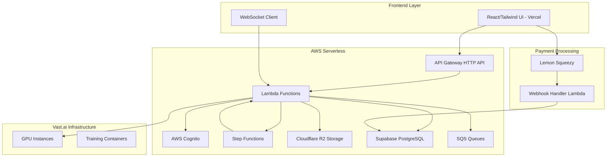

# Design Document: NeuralShot Platform

## Overview

NeuralShot es una plataforma SaaS cloud-native que orquesta entrenamiento e inferencia de modelos de IA usando una arquitectura híbrida: AWS para servicios base y Vast.ai para cómputo GPU bajo demanda. La arquitectura está diseñada para optimizar costos, escalabilidad y experiencia de usuario.

## Architecture

### High-Level Architecture (Cost-Optimized Serverless)



### Component Architecture

#### Frontend Layer
- **React SPA**: Interfaz de usuario con Tailwind CSS y tema dark mode VFX
- **Hosting**: Vercel (Free Tier - $0/mes para proyectos personales)
- **WebSocket Connection**: Comunicación en tiempo real para updates de entrenamiento
- **State Management**: Zustand para manejo de estado global
- **File Upload**: Componente drag-and-drop con validación client-side

#### API Gateway Layer
- **API Gateway HTTP API**: Reemplaza ALB, $1/millón de requests (vs $16-20/mes ALB)
- **Lambda Functions**: Serverless compute, $0 en Free Tier hasta 400k GB-seconds
- **Authentication**: AWS Cognito JWT integration
- **Rate Limiting**: Implementado en Lambda con DynamoDB

#### Database Layer
- **Supabase**: PostgreSQL serverless, $0 Free Tier hasta 500MB
- **Alternative**: Neon PostgreSQL serverless
- **No NAT Gateway**: Acceso directo vía internet público seguro

#### Storage Layer
- **Cloudflare R2**: S3-compatible, $0 egress fees (crítico para Vast.ai transfers)
- **Bucket Structure**: `neuralshot-datasets-{env}`
- **Lifecycle**: Auto-delete after 7 days

## Components and Interfaces

### 1. User Management Service

```python
class UserService:
    def authenticate_user(self, token: str) -> User
    def get_user_credits(self, user_id: str) -> CreditBalance
    def deduct_credits(self, user_id: str, amount: float) -> bool
    def add_credits(self, user_id: str, amount: float) -> CreditBalance
```

**Interfaces:**
- REST API: `/api/v1/users/{user_id}` (via API Gateway)
- Lambda Functions: User management operations
- WebSocket: Real-time credit updates

### 2. Dataset Management Service

```python
class DatasetService:
    def upload_dataset(self, user_id: str, files: List[UploadFile]) -> Dataset
    def validate_dataset(self, dataset_id: str) -> ValidationResult
    def analyze_consistency(self, dataset_id: str) -> AnalysisResult
    def get_dataset_preview(self, dataset_id: str, frame: int) -> ImagePair
```

**Storage Strategy:**
- Provider: Cloudflare R2 (AWS S3 Compatible API)
- Rationale: Zero egress fees for high-volume data transfer to Vast.ai
- Bucket Structure: `neuralshot-datasets-{env}`
- Prefix Structure: `{user_id}/{dataset_id}/{input|gt}/`
- Lifecycle Policy: Delete after 7 days
- Multipart Upload: Para archivos > 100MB

### 3. Training Orchestration Service

```python
class TrainingOrchestrator:
    def create_training_job(self, config: TrainingConfig) -> TrainingJob
    def provision_vast_instance(self, requirements: GPURequirements) -> VastInstance
    def deploy_training_container(self, instance: VastInstance, job: TrainingJob) -> Deployment
    def monitor_training_progress(self, job_id: str) -> TrainingStatus
    def terminate_instance(self, instance_id: str) -> bool
```

**Step Functions Workflow:**
1. **Validate Job**: Verificar créditos y configuración
2. **Provision GPU**: Crear instancia en Vast.ai
3. **Deploy Container**: Subir código y datos
4. **Monitor Training**: Polling de estado cada 30s
5. **Handle Completion**: Descargar modelo y limpiar recursos
6. **Cleanup**: Terminar instancia y notificar usuario

### 4. Real-time Monitoring Service

```python
class MonitoringService:
    def stream_training_metrics(self, job_id: str) -> AsyncGenerator[Metrics]
    def get_training_preview(self, job_id: str) -> TrainingPreview
    def send_status_update(self, job_id: str, status: JobStatus) -> None
```

**WebSocket Events:**
- `training.started`
- `training.progress` (loss, epoch, ETA)
- `training.preview_updated`
- `training.completed`
- `training.failed`

### 6. Billing Service (Lemon Squeezy Integration)

```python
class BillingService:
    def create_checkout_session(self, user_id: str, plan_id: str) -> str:
        """Create Lemon Squeezy checkout URL for subscription"""
        checkout_data = {
            "data": {
                "type": "checkouts",
                "attributes": {
                    "custom_data": {"user_id": user_id}
                },
                "relationships": {
                    "store": {"data": {"type": "stores", "id": STORE_ID}},
                    "variant": {"data": {"type": "variants", "id": plan_id}}
                }
            }
        }
        response = requests.post(
            "https://api.lemonsqueezy.com/v1/checkouts",
            headers={"Authorization": f"Bearer {LEMON_API_KEY}"},
            json=checkout_data
        )
        return response.json()["data"]["attributes"]["url"]
    
    def handle_webhook(self, payload: Dict, signature: str) -> None:
        """Process Lemon Squeezy webhook events"""
        if not self._verify_signature(payload, signature):
            raise SecurityError("Invalid webhook signature")
            
        event_name = payload["meta"]["event_name"]
        
        if event_name == "subscription_created":
            self._activate_subscription(payload["data"])
        elif event_name == "subscription_updated":
            self._update_subscription(payload["data"])
        elif event_name == "subscription_expired":
            self._deactivate_subscription(payload["data"])
    
    def _verify_signature(self, payload: Dict, signature: str) -> bool:
        """Verify webhook signature using HMAC"""
        import hmac
        import hashlib
        
        expected = hmac.new(
            WEBHOOK_SECRET.encode(),
            json.dumps(payload).encode(),
            hashlib.sha256
        ).hexdigest()
        
        return hmac.compare_digest(signature, expected)
    
    def generate_invoice(self, transaction_id: str) -> bytes:
        """Generate PDF invoice for completed transaction"""
        # Implementation using reportlab or similar
        pass
```

**Lemon Squeezy Integration Points:**
- Checkout URLs: Generated on-demand via API
- Webhook Handler: Lambda function for subscription events
- Custom Data: Pass user_id for account linking
- Events: subscription_created, subscription_updated, subscription_expired
- Security: HMAC signature verification

## Data Models

### Core Entities

```python
@dataclass
class User:
    id: str
    email: str
    credits: float
    tier: UserTier
    created_at: datetime

@dataclass
class Dataset:
    id: str
    user_id: str
    name: str
    input_frames: int
    gt_frames: int
    validation_frames: List[int]
    health_score: Optional[float]
    analysis_results: Optional[AnalysisResult]
    uploaded_at: datetime
    expires_at: datetime

@dataclass
class TrainingJob:
    id: str
    user_id: str
    dataset_id: str
    config: TrainingConfig
    status: JobStatus
    vast_instance_id: Optional[str]
    current_epoch: int
    total_epochs: int
    current_loss: float
    best_loss: float
    estimated_completion: Optional[datetime]
    created_at: datetime

@dataclass
class TrainingConfig:
    preset: PresetType  # FAST_DRAFT, STANDARD, HIGH_FIDELITY, EXPERIMENTAL
    epochs: int
    batch_size: int
    learning_rate: float
    gpu_requirements: GPURequirements
    estimated_cost: float

@dataclass
class InferenceJob:
    id: str
    user_id: str
    model_id: str
    tier: InferenceTier
    input_frames: int
    status: JobStatus
    cost: float
    result_url: Optional[str]
    created_at: datetime
```

### Database Schema

```sql
-- PostgreSQL Schema
CREATE TABLE users (
    id UUID PRIMARY KEY DEFAULT gen_random_uuid(),
    email VARCHAR(255) UNIQUE NOT NULL,
    credits DECIMAL(10,2) DEFAULT 0.00,
    tier VARCHAR(20) DEFAULT 'FREE',
    created_at TIMESTAMP DEFAULT NOW()
);

CREATE TABLE datasets (
    id UUID PRIMARY KEY DEFAULT gen_random_uuid(),
    user_id UUID REFERENCES users(id),
    name VARCHAR(255) NOT NULL,
    s3_prefix VARCHAR(500) NOT NULL,
    input_frames INTEGER NOT NULL,
    gt_frames INTEGER NOT NULL,
    validation_frames INTEGER[],
    health_score DECIMAL(5,2),
    analysis_results JSONB,
    uploaded_at TIMESTAMP DEFAULT NOW(),
    expires_at TIMESTAMP DEFAULT NOW() + INTERVAL '7 days'
);

CREATE TABLE training_jobs (
    id UUID PRIMARY KEY DEFAULT gen_random_uuid(),
    user_id UUID REFERENCES users(id),
    dataset_id UUID REFERENCES datasets(id),
    config JSONB NOT NULL,
    status VARCHAR(20) DEFAULT 'PENDING',
    vast_instance_id VARCHAR(100),
    metrics JSONB,
    model_s3_key VARCHAR(500),
    created_at TIMESTAMP DEFAULT NOW(),
    completed_at TIMESTAMP
);

CREATE TABLE inference_jobs (
    id UUID PRIMARY KEY DEFAULT gen_random_uuid(),
    user_id UUID REFERENCES users(id),
    model_id UUID,
    tier VARCHAR(20) NOT NULL,
    input_s3_key VARCHAR(500) NOT NULL,
    result_s3_key VARCHAR(500),
    status VARCHAR(20) DEFAULT 'PENDING',
    cost DECIMAL(8,2) NOT NULL,
    created_at TIMESTAMP DEFAULT NOW()
);
```

## Error Handling

### Error Categories

1. **User Errors (4xx)**
   - Insufficient credits
   - Invalid file format
   - Quota exceeded
   - Authentication failed

2. **System Errors (5xx)**
   - Vast.ai provisioning failed
   - S3 upload timeout
   - Training container crashed
   - Database connection lost

3. **Infrastructure Errors**
   - GPU instance unavailable
   - Network connectivity issues
   - Container deployment failed

### Error Recovery Strategies

```python
class ErrorHandler:
    def handle_vast_provisioning_failure(self, job: TrainingJob) -> None:
        # Retry with different GPU configuration
        # Fallback to alternative providers
        # Refund credits if all attempts fail
        
    def handle_training_failure(self, job: TrainingJob, error: Exception) -> None:
        # Save partial progress if available
        # Retry from last checkpoint (max 3 attempts)
        # Partial refund for incomplete training
        
    def handle_upload_failure(self, upload: DatasetUpload) -> None:
        # Resume multipart upload
        # Cleanup orphaned parts
        # Notify user of retry options
```

## Cost Analysis (Estimated)

### Fixed Monthly Costs (Base Infrastructure)
- **Frontend Hosting (Vercel)**: $0 (Free Tier)
- **Backend Compute (Lambda)**: $0 (Free Tier < 400k GB-seconds)
- **Database (Supabase)**: $0 (Free Tier < 500MB)
- **Storage (Cloudflare R2)**: $0 (First 10GB free)
- **API Gateway**: $0 (Free Tier < 1M requests)
- **Total Fixed Cost: ~$0.00/mes**

### Variable Costs (Per Training Job - Example)
- **Vast.ai GPU (RTX 3090, 45 mins)**: $0.15
- **Data Transfer (R2 to Vast)**: $0.00 (Zero egress fees)
- **Step Function Transitions**: ~$0.0002
- **Lambda Compute**: ~$0.001
- **Total Operational Cost per Job: ~$0.1512**

### Scaling Projections (100 Active Users)
- **Monthly Training Jobs**: ~300 jobs
- **Variable Costs**: 300 × $0.15 = $45
- **Fixed Infrastructure**: $0
- **Payment Processing (Lemon Squeezy)**: 5% + $0.50 per transaction
- **Total Monthly Cost**: ~$45-60

### Cost Comparison vs Traditional Architecture
**Traditional (ALB + RDS + NAT Gateway)**:
- ALB: $16-20/mes
- RDS PostgreSQL: $15/mes  
- NAT Gateway: $32/mes
- **Total Idle Cost**: $63-67/mes

**Optimized Serverless**:
- **Total Idle Cost**: $0/mes
- **Savings**: $63-67/mes (100% reduction in fixed costs)

## Testing Strategy

### Unit Testing
- Service layer methods with mocked dependencies
- Data validation and transformation logic
- Cost calculation algorithms
- Error handling scenarios

### Integration Testing
- API endpoints with Supabase test database
- Cloudflare R2 upload/download operations
- WebSocket connection handling via Lambda
- Authentication flow with Cognito
- Lemon Squeezy webhook processing

### End-to-End Testing
- Complete training workflow simulation
- File upload and processing pipeline
- Real-time monitoring and notifications
- Multi-user concurrent operations

### Property-Based Testing
- Cost calculation properties across different configurations
- Data consistency during upload and processing
- State transitions in training workflow
- Credit system invariants

**Testing Configuration:**
- Framework: pytest with pytest-asyncio
- Property Testing: Hypothesis
- Mocking: pytest-mock
- Test Database: PostgreSQL with pytest-postgresql
- Minimum 100 iterations per property test
- Minimum 100 iterations per property test

## Correctness Properties

*A property is a characteristic or behavior that should hold true across all valid executions of a system—essentially, a formal statement about what the system should do. Properties serve as the bridge between human-readable specifications and machine-verifiable correctness guarantees.*

### Property 1: User Registration Consistency
*For any* valid email address, user registration should create exactly one account and send exactly one verification email
**Validates: Requirements 1.1**

### Property 2: Authentication Determinism
*For any* set of credentials, authentication should consistently return the same result (success for valid, failure for invalid)
**Validates: Requirements 1.2**

### Property 3: Credit System Invariants
*For any* sequence of credit operations (deductions, additions), the final balance should equal initial balance plus all additions minus all deductions
**Validates: Requirements 1.4, 4.4**

### Property 4: Dataset Upload Validation
*For any* uploaded file, if it matches supported formats (PNG, JPG, EXR), it should be accepted; otherwise rejected
**Validates: Requirements 2.2**

### Property 5: Frame Correspondence Preservation
*For any* dataset with N input frames and N ground truth frames, the system should maintain 1:1 correspondence throughout all operations
**Validates: Requirements 2.4**

### Property 6: Carousel Synchronization
*For any* scroll operation on either carousel strip, both strips should move to the same relative position
**Validates: Requirements 2.5**

### Property 7: Validation Frame Limit Enforcement
*For any* validation frame selection, the system should never allow more than 4 frames to be selected
**Validates: Requirements 2.6**

### Property 8: Data Retention Policy
*For any* uploaded dataset, it should be automatically deleted exactly 7 days after upload
**Validates: Requirements 2.7**

### Property 9: Health Score Range Validation
*For any* dataset analysis, the generated health score should always be between 0 and 100 inclusive
**Validates: Requirements 3.2**

### Property 10: Cost Calculation Consistency
*For any* training configuration, the cost calculation should be deterministic and based on GPU hours, data transfer, and storage usage
**Validates: Requirements 4.2, 4.4**

### Property 11: Credit Validation Enforcement
*For any* job submission, if user credits are insufficient for estimated cost, the submission should be rejected
**Validates: Requirements 4.5**

### Property 12: Instance Lifecycle Management
*For any* training job, a Vast instance should be provisioned at start and terminated within 5 minutes of completion
**Validates: Requirements 5.1, 5.3**

### Property 13: Retry Logic Bounds
*For any* failed training job, the system should attempt exactly 3 retries before marking it as permanently failed
**Validates: Requirements 5.4**

### Property 14: Monitoring Update Frequency
*For any* active training job, status updates should be sent at intervals not exceeding 30 seconds
**Validates: Requirements 5.6**

### Property 15: Preview Update Rate Limiting
*For any* training session, preview image updates should not exceed one update per 5 seconds
**Validates: Requirements 6.3**

### Property 16: Job Persistence
*For any* training job, closing the browser should not affect the job's execution on the server
**Validates: Requirements 6.5**

### Property 17: Model Artifact Generation
*For any* successfully completed training job, a downloadable model artifact in PyTorch format should be generated
**Validates: Requirements 7.1, 7.2**

### Property 18: Deletion Warning Timing
*For any* dataset approaching 7-day expiration, a warning should be sent exactly 24 hours before deletion
**Validates: Requirements 7.3**

### Property 19: File Integrity Verification
*For any* model download, the file should include a checksum that verifies the integrity of the downloaded content
**Validates: Requirements 7.5**

### Property 20: Tier Limit Enforcement
*For any* inference request, Free Tier should enforce 100 frame and 200MB limits, while Pro Tier should support up to 8K resolution and 8GB
**Validates: Requirements 8.1, 8.2**

### Property 21: Pro Tier Pricing Formula
*For any* Pro Tier inference job, the cost should equal (frame_count / 240) * $0.20, rounded to nearest cent
**Validates: Requirements 8.3**

### Property 22: Temporal Consistency Preservation
*For any* video inference job, the output should maintain the same temporal relationships as the input sequence
**Validates: Requirements 8.6**

### Property 23: API Error Format Consistency
*For any* API error response, it should follow the same JSON structure with consistent field names and types
**Validates: Requirements 9.3**

### Property 24: Rate Limiting Enforcement
*For any* authenticated user, API requests should be limited to exactly 1000 requests per hour
**Validates: Requirements 9.5**

### Property 25: Webhook Delivery Guarantee
*For any* job status change, a webhook notification should be sent to all registered endpoints
**Validates: Requirements 9.6**

### Property 26: Encryption Protocol Compliance
*For any* data transmission, TLS 1.3 should be used, and for any stored data, AES-256 encryption should be applied
**Validates: Requirements 10.1, 10.2**

### Property 27: Container Isolation
*For any* data processing job on Vast instances, containers should be isolated with no persistent data storage
**Validates: Requirements 10.3**

### Property 28: Audit Log Completeness
*For any* system operation, a corresponding audit log entry should be created with timestamp, user, and action details
**Validates: Requirements 10.5**